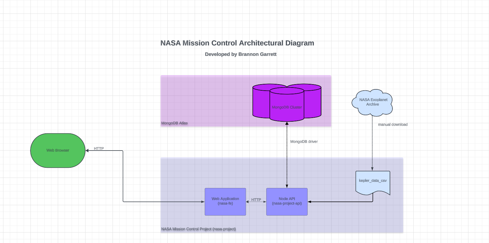

# NASA Project 

## Overview

This repository contains the NASA Project, a full-stack application developed as part of the "Complete Node.js Developer: Zero to Mastery" course. The project simulates a NASA dashboard for managing space missions and leverages real-life data, including the SpaceX API, to create a comprehensive launch system for discovering new planets.

## NASA Mission Control Diagram

## Technologies Used

- **Node.js**: JavaScript runtime for building the server-side of the application.
- **Express.js**: Web application framework for Node.js to handle HTTP requests.
- **React**: Front-end library for building the user interface.
- **MongoDB**: NoSQL database for storing application data.
- **GraphQL**: Query language for APIs and runtime for executing queries.
- **Jest**: A testing framework for JavaScript.
- **Morgan**: HTTP request logger middleware for Node.js.
- **GitHub Actions**: For CI/CD.
- **Postman**: An API platform for sending HTTP requests to the NASA API.
- **Docker**: Used to containerize the project for deployment to AWS.

## Stack

The application is built using the MERN stack, which includes:

- **MongoDB**: Document database used for storing application data.
- **Express.js**: Back-end web application framework running on top of Node.js.
- **React**: Front-end JavaScript library for building user interfaces.
- **Node.js**: JavaScript runtime environment that executes JavaScript code server-side.

## Deployment

The application is containerized with Docker and deployed to AWS (Amazon Web Services), ensuring scalability and reliability. AWS services provide the infrastructure necessary to host and manage the application, allowing it to handle large-scale user access and data processing.

## See it in action

Visit the link in the About section to see the project live. You can create launches and delete launches as well as see historic launches from SpaceX.
